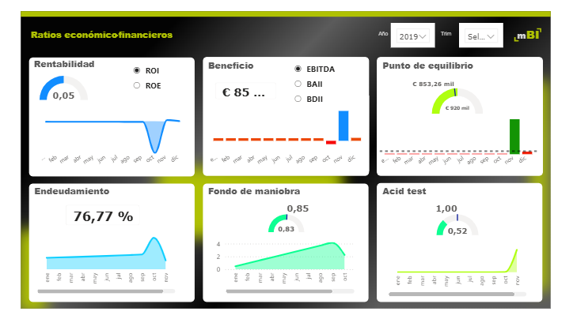

<h1 align="center">Análisis de ratios económico-financiero</h1>

## 1. Descripción
El dashboard interactivo de análisis económico-financiero permite evaluar la salud financiera de una organización a través de indicadores clave, como la rentabilidad, el endeudamiento, la liquidez y el punto de equilibrio, a lo largo del período 2019–2024, facilitando así la toma de decisiones basada en datos.

---
## 2. Dataset
El conjunto de datos utilizado incluye información financiera estructurada.
Se definió la tabla de hechos (factDiario), la cual contiene los movimientos financieros (importe, cuentas y fechas). Asimismo, se definieron las siguientes tablas de dimensiones:
- dimCalendario: incluye fechas, años, trimestres, meses y otros atributos temporales, con un rango que abarca de 2019 a 2024.
- dimPGC: contiene la estructura contable (cuentas, agrupaciones y clasificación financiera).

---
## 3. Herramientas Utilizadas
- Power BI- DAX (Data Analysis Expressions)
- Modelado de datos en esquema estrella.
  
**Vista del Dashboard**

---
## 4. Análisis

El dashboard presenta diferentes métricas y visualizaciones que permiten comprender el comportamiento de compra de los clientes:

Métricas principales
- Ticket promedio
- Gasto promedio por cliente
- Variabilidad del gasto por cliente
- Porcentaje de clientes en riesgo

Análisis realizados:
- Comparación del gasto promedio según nivel educativo
- Variabilidad del gasto por perfil educativo
- Distribución del gasto por categoría de producto
- Promedio de categorías activas por estado civil y nivel educativo
- Identificación de clientes con mayor riesgo de churn
Además, el dashboard incluye filtros interactivos para analizar los resultados según el estado civil, categoría de edad, categoría de ingresos y número de hijos

---
## 5. Hallazgos

A partir del análisis del dashboard (enfocado en 2019):
- Rentabilidad baja: el ROI muestra valores reducidos, indicando baja eficiencia en el uso de los recursos.
- EBITDA positivo pero limitado: sugiere generación de beneficios, aunque con margen de mejora.
- Punto de equilibrio elevado: la empresa requiere un nivel significativo de ingresos para ser rentable.
- Alto endeudamiento (~76,77%): dependencia considerable de financiación externa.
- Fondo de maniobra ajustado: capacidad limitada para cubrir obligaciones a corto plazo.
- Liquidez crítica (Acid Test < 1): posibles dificultades para afrontar pasivos inmediatos.
